# 🚀 RETAIN-AI : AI-Powered Customer Intelligence & Retention Analytics Platform

### CLV-Driven Customer Churn Prediction & Retention Intelligence Platform

An end-to-end AI-powered customer analytics platform that combines Customer Lifetime Value (CLV) analysis, churn prediction, customer segmentation, explainable AI, and executive reporting into a unified decision-support system.


---

## 📌 Overview

RetainAI is a production-style customer intelligence platform developed to help businesses identify customers at risk of churn, analyze Customer Lifetime Value (CLV), explore customer segments, and support data-driven retention strategies. The platform combines statistical customer value modeling with machine learning-based churn prediction to provide actionable business insights.

The platform combines machine learning with interactive analytics through a Streamlit frontend, a FastAPI backend, and a SQLite database, providing a modular and scalable architecture suitable for educational, portfolio, and demonstration purposes.

---

# ✨ Key Features

## 📊 Executive Dashboard
- Interactive business dashboard with real-time KPIs.
- Revenue analytics and customer portfolio overview.
- Customer segmentation and intervention insights.
- Interactive visualizations powered by Plotly.

---

## 👥 Customer Intelligence
- Search customers by Customer ID.
- Advanced filtering by country, segment, and churn status.
- Customer 360 profile with behavioral metrics.
- Personalized retention recommendations.

---

## 🎯 Segmentation Analytics
- RFM-based customer segmentation analysis.
- Visual exploration of customer segments.
- Segment-wise revenue and customer distribution.
- Business insights to identify high-value and at-risk customer groups.

---

## 🤖 Prediction Center
- Predict churn probability for existing customers.
- Manual prediction for hypothetical customers.
- Real-time machine learning inference using FastAPI.
- Session-based prediction history.

---

## 🧠 Explainable AI
- Model performance metrics.
- ROC Curve visualization.
- Confusion Matrix.
- Feature importance analysis.
- Business interpretation of model outputs.

---

## 📄 Reports & Export
- Executive summary generation.
- Customer report export.
- High-risk customer report.
- Segment summary export.
- Prediction history export.

---

## ⚙️ Production Architecture
- Streamlit frontend.
- FastAPI backend.
- SQLite database.
- Modular service-layer architecture.
- RESTful API communication.

---

# 🏗️ System Architecture

RetainAI follows a modular, production-style architecture that separates the presentation layer, business logic, machine learning services, and data storage. This design improves scalability, maintainability, and makes the application easy to extend with future features.

```text
                           ┌──────────────────────────────┐
                           │       Streamlit Frontend     │
                           │──────────────────────────────│
                           │ • Dashboard                 │
                           │ • Customer Intelligence     │
                           │ • Segmentation Analytics    │
                           │ • Prediction Center         │
                           │ • Model Insights            │
                           │ • Reports & Export          │
                           └──────────────┬──────────────┘
                                          │
                                  REST API Requests
                                          │
                                          ▼
                           ┌──────────────────────────────┐
                           │       FastAPI Backend        │
                           │──────────────────────────────│
                           │ • Dashboard API             │
                           │ • Customer API              │
                           │ • Prediction API            │
                           │ • Model API                │
                           │ • Reports API             │
                           └──────────────┬──────────────┘
                                          │
                    ┌─────────────────────┴─────────────────────┐
                    │                                           │
                    ▼                                           ▼
        ┌──────────────────────┐                  ┌────────────────────────┐
        │  Machine Learning    │                  │     SQLite Database     │
        │──────────────────────│                  │────────────────────────│
        │ • Churn Prediction   │                  │ • Customers            │
        │ • CLV Analytics      │                  │ • Transactions         │
        │ • Feature Scaling    │                  │ • Model Metadata       │
        │ • Model Inference    │                  │ • Predictions          │
        └──────────────────────┘                  └────────────────────────┘
```

### Architecture Highlights

- **Frontend:** Built with Streamlit for an interactive analytics experience.
- **Backend:** FastAPI exposes REST APIs and separates business logic from the UI.
- **Machine Learning:** Scikit-learn models provide real-time churn prediction and customer analytics.
- **Database:** SQLite stores customer records, transaction history, predictions, and model metadata.
- **Communication:** All frontend interactions occur through REST APIs, ensuring a clean separation of concerns.

---

# 📸 Project Screenshots

The following screenshots showcase the major modules of the RetainAI platform.

## 📊 Dashboard

> Executive dashboard providing KPIs, customer insights, revenue analytics, and business performance visualization.

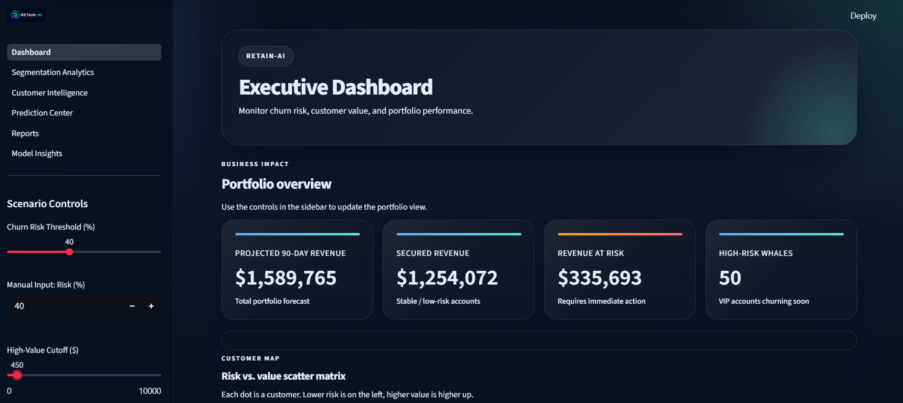
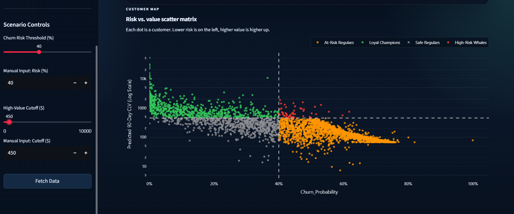

---

## 🎯 Segmentation Analytics

> Explore customer segments using RFM-based analytics and visualize segment distribution, customer behavior, and business value.

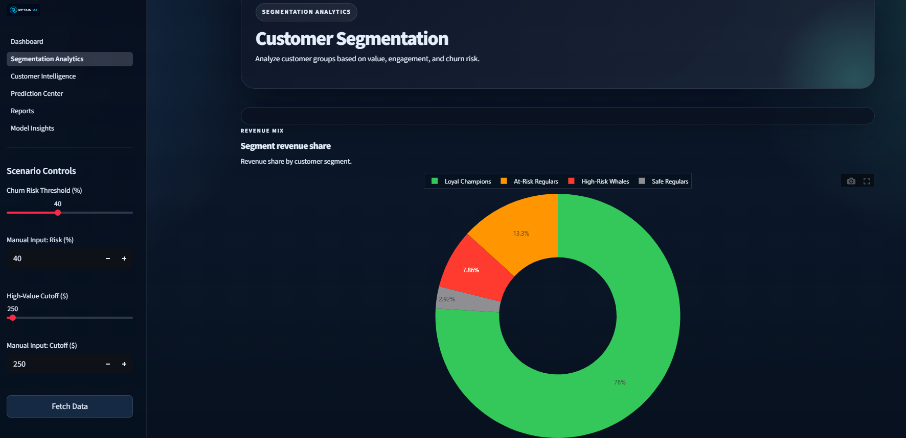

---

## 👥 Customer Intelligence

> Search, filter, and analyze customers with a detailed Customer 360 profile including business metrics and retention insights.

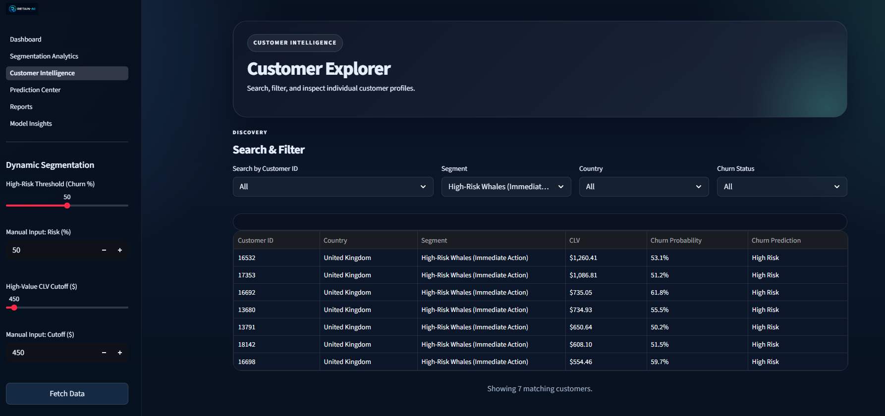
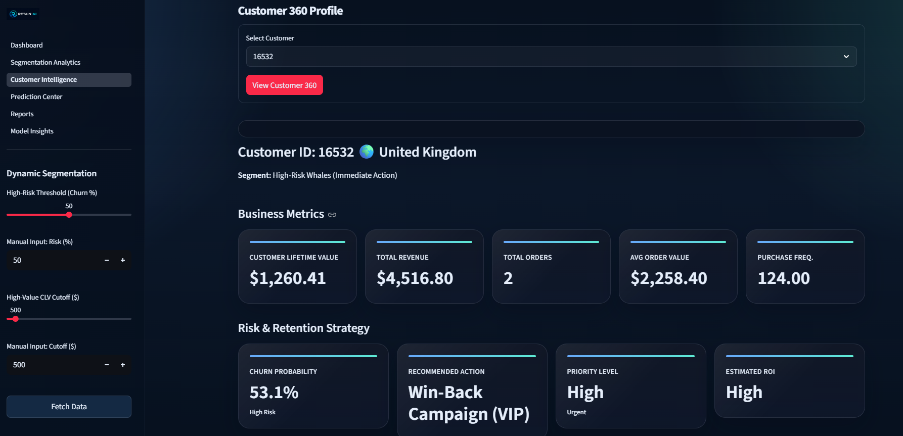

---

## 🤖 Prediction Center

> Predict churn probability for existing customers or evaluate hypothetical customers using the trained machine learning model.

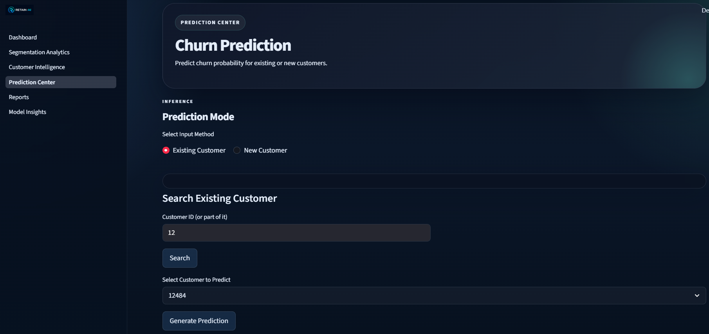
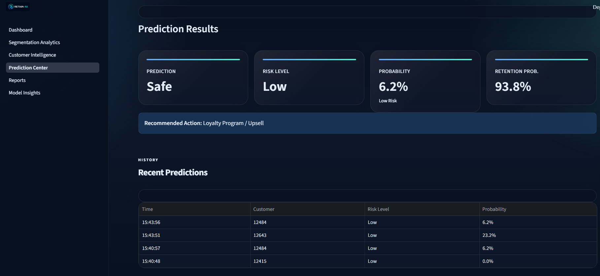

---

## 📄 Reports & Export

> Generate executive summaries and export customer, high-risk, and segmentation reports for business analysis.

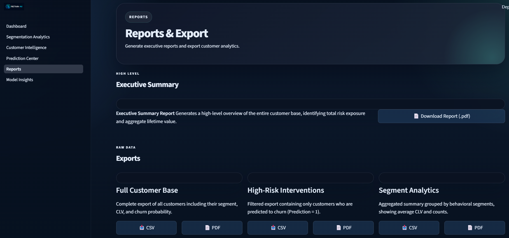

---

## 🧠 Model Insights

> Understand model performance through evaluation metrics, ROC Curve, Confusion Matrix, and feature importance analysis.

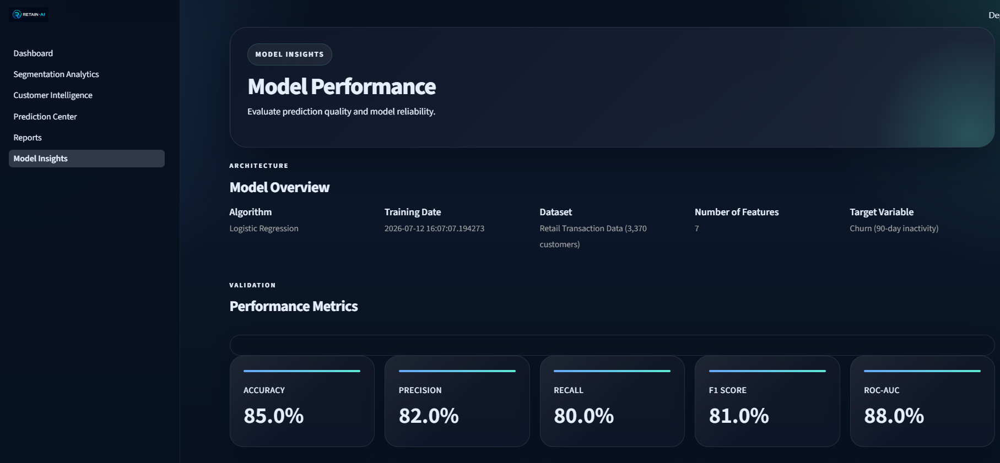
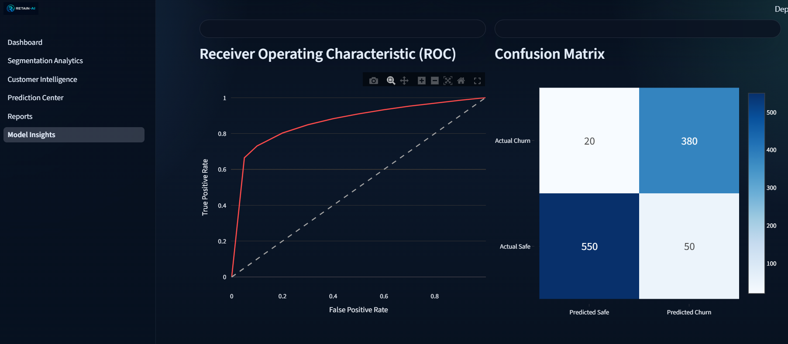
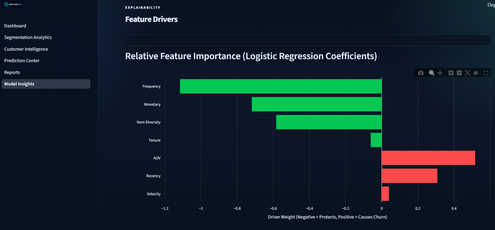

---

# 💻 Technology Stack

RetainAI is built using a modern, modular technology stack that separates the frontend, backend, machine learning, and data layers.

| Layer | Technology | Purpose |
|--------|------------|---------|
| **Frontend** | Streamlit | Interactive web application and dashboards |
| **Backend** | FastAPI | REST API and business logic |
| **Machine Learning** | Scikit-learn | Churn prediction and customer analytics |
| **Data Processing** | Pandas, NumPy | Data cleaning and feature engineering |
| **Database** | SQLite | Customer, transaction, and model data storage |
| **Visualization** | Plotly | Interactive charts and analytics |
| **Model Serialization** | Joblib | Saving and loading trained ML models |
| **Validation** | Pydantic | Request and response validation |
| **Environment Management** | Python Virtual Environment (.venv) | Dependency isolation |
| **Version Control** | Git & GitHub | Source code management |

---

## 🧠 Machine Learning Models

| Component | Algorithm | Purpose |
|-----------|-----------|---------|
| Churn Prediction | Logistic Regression | Predicts customer churn probability using behavioral and RFM features. |
| Feature Scaling | StandardScaler | Normalizes numerical features before model inference. |
| Customer Lifetime Value (CLV) | BG/NBD + Gamma-Gamma | Estimates projected 90-day Customer Lifetime Value during the data preparation pipeline. |

---

## 📂 Dataset

- **Dataset:** Online Retail II
- **Domain:** Retail Customer Analytics
- **Customers:** ~3,370
- **Transactions:** ~397,000+
- **Features:** RFM metrics, CLV indicators, behavioral features, and engineered customer attributes.


---

# 📂 Project Structure

The project follows a modular architecture that separates the frontend, backend, machine learning pipeline, database, and documentation for better maintainability and scalability.

```text
retainai/
│
├── backend/                 # FastAPI backend
│   ├── api/                 # REST API endpoints
│   ├── config/              # Application configuration
│   ├── database/            # Database connection utilities
│   ├── ml/                  # Machine learning model loader
│   ├── schemas/             # Pydantic request/response models
│   ├── services/            # Business logic
│   ├── utils/               # Logging and helper utilities
│   └── main.py              # FastAPI application entry point
│
├── frontend/                # Streamlit frontend
│   ├── assets/              # Images and static resources
│   ├── components/          # Reusable UI components
│   ├── pages/               # Application pages
│   ├── utils/               # API client and UI helpers
│   └── app.py               # Streamlit entry point
│
├── data/
│   ├── raw/                 # Original dataset
│   └── processed/           # Engineered datasets
│
├── database/
│   ├── retail.db            # SQLite database
│   └── README.md            # Database documentation
│
├── docs/
│   ├── milestones/          # Development milestones
│   └── screenshots/         # README screenshots
│
├── models/
│   └── churn/               # Trained ML models
│
├── notebooks/               # End-to-end ML pipeline
│
├── scripts/                 # Utility scripts
│
├── README.md
├── requirements.txt
├── .env.example
└── .gitignore
```

### Repository Highlights

- **Modular architecture** with a clear separation between frontend, backend, and machine learning.
- **REST API-based communication** between Streamlit and FastAPI.
- **Reusable service layer** to isolate business logic from API routes.
- **Dedicated documentation** for milestones, database schema, and screenshots.
- **Notebook-driven machine learning workflow** for reproducibility.

---

# 🧠 Machine Learning Pipeline

RetainAI follows a complete machine learning workflow, starting from raw transactional data and ending with an interactive customer intelligence platform.

```text
                           Online Retail II Dataset
                                      │
                                      ▼
                     Data Cleaning & Preprocessing
                 (Missing Values, Duplicates, Formatting)
                                      │
                                      ▼
                        Feature Engineering & RFM Analysis
             (Recency, Frequency, Monetary, Customer Behavior)
                                      │
                     ┌────────────────┴────────────────┐
                     ▼                                 ▼
        Customer Lifetime Value                 Churn Prediction
             (BG/NBD + Gamma-Gamma)          (Logistic Regression)
                     │                                 │
                     └────────────────┬────────────────┘
                                      ▼
                      Master Customer Feature Dataset
                                      │
                                      ▼
                           SQLite Database (retail.db)
                                      │
                                      ▼
                           FastAPI Backend Services
                                      │
                                      ▼
                         Streamlit Customer Platform
```

## Machine Learning Workflow

### 1. Data Collection
- Imported the Online Retail II dataset.
- Performed initial data validation and quality assessment.

### 2. Data Preprocessing
- Removed missing and duplicate records.
- Filtered invalid transactions.
- Standardized data types and formats.

### 3. Feature Engineering
- Generated customer-level behavioral features.
- Computed RFM (Recency, Frequency, Monetary) metrics.
- Engineered additional features including customer tenure, purchase velocity, average order value, and item diversity.

### 4. Customer Lifetime Value (CLV)
- Estimated future purchase frequency using the **BG/NBD** model.
- Estimated future monetary value using the **Gamma-Gamma** model.
- Calculated projected **90-day Customer Lifetime Value (CLV)**.

### 5. Churn Prediction
- Trained a **Logistic Regression** model.
- Applied **StandardScaler** for feature normalization.
- Generated churn probabilities and binary churn predictions.

### 6. Deployment Pipeline
- Stored engineered customer data and predictions in SQLite.
- Exposed business logic through FastAPI REST APIs.
- Delivered predictions and analytics through the Streamlit frontend.

---

# ⚙️ Installation & Setup

Follow the steps below to set up and run RetainAI on your local machine.

## 1️⃣ Clone the Repository

```bash
git clone https://github.com/abhilashreddypendyala/retainai.git
cd retainai
```
---

## 2️⃣ Create a Virtual Environment

### Windows

```bash
python -m venv .venv
.venv\Scripts\activate
```

### macOS / Linux

```bash
python3 -m venv .venv
source .venv/bin/activate
```

---

## 3️⃣ Install Dependencies

```bash
pip install -r requirements.txt
```

---

## 4️⃣ Configure Environment Variables

Create a `.env` file in the project root by copying the example file.

### Windows

```bash
copy .env.example .env
```

### macOS / Linux

```bash
cp .env.example .env
```

Update the environment variables if required.

---

## 5️⃣ Database Setup

The repository includes a ready-to-use SQLite database.

If you wish to regenerate the database from the processed datasets, run:

```bash
python scripts/create_database.py
```

---

## 6️⃣ Start the FastAPI Backend

```bash
uvicorn backend.main:app --reload
```

The backend will start at:

```
http://127.0.0.1:8000
```

API Documentation:

```
http://127.0.0.1:8000/docs
```

---

## 7️⃣ Start the Streamlit Frontend

Open another terminal and run:

```bash
streamlit run frontend/app.py
```

The application will open automatically in your browser.

Default URL:

```
http://localhost:8501
```

---

## 8️⃣ Verify the Installation

After both services are running:

- Open the Streamlit application.
- Navigate through all application modules.
- Verify that the Dashboard loads correctly.
- Test the Prediction Center with an existing customer.
- Confirm that Reports can be generated successfully.

If all pages load correctly, RetainAI has been installed successfully.

---

# 🌐 API Overview

RetainAI follows a RESTful architecture where the Streamlit frontend communicates exclusively with the FastAPI backend. All business logic, machine learning inference, and database interactions are handled through dedicated API endpoints.

## Base URL

```
http://127.0.0.1:8000
```

Interactive API documentation is available at:

```
http://127.0.0.1:8000/docs
```

---

## Available Endpoints

### Health

| Method | Endpoint | Description |
|--------|----------|-------------|
| GET | `/health` | Verify backend availability and service health. |

---

### Dashboard

| Method | Endpoint | Description |
|--------|----------|-------------|
| GET | `/dashboard/summary` | Returns dashboard KPI metrics. |
| GET | `/dashboard/charts` | Returns data for dashboard visualizations. |
| GET | `/dashboard/interventions` | Retrieves high-value customers requiring intervention. |
| GET | `/dashboard/model-summary` | Returns model metadata displayed on the dashboard. |

---

### Customer Intelligence

| Method | Endpoint | Description |
|--------|----------|-------------|
| GET | `/customers` | Returns paginated customer records. |
| GET | `/customers/search` | Searches customers by Customer ID. |
| GET | `/customers/filter` | Filters customers by segment, country, and churn status. |
| GET | `/customers/{customer_id}` | Returns the complete Customer 360 profile. |

---

### Prediction Center

| Method | Endpoint | Description |
|--------|----------|-------------|
| POST | `/prediction` | Predicts customer churn probability using the trained Logistic Regression model. |

---

### Model Insights

| Method | Endpoint | Description |
|--------|----------|-------------|
| GET | `/model/insights` | Returns model evaluation metrics, feature importance, ROC data, and confusion matrix information. |

---

### Reports

| Method | Endpoint | Description |
|--------|----------|-------------|
| GET | `/reports/executive-summary` | Returns executive business summary. |
| GET | `/reports/customer-report` | Downloads the complete customer report (CSV). |
| GET | `/reports/high-risk` | Downloads the high-risk customer report (CSV). |
| GET | `/reports/segment-summary` | Downloads the customer segmentation summary (CSV). |

---

## API Design Principles

- RESTful endpoint design.
- Modular service-layer architecture.
- Request and response validation using Pydantic.
- Separation of presentation, business logic, and data access.
- JSON-based communication between frontend and backend.
- Easily extensible architecture for future APIs.


---

# 🚀 Future Roadmap

RetainAI is designed with a modular architecture that makes it easy to extend with new capabilities. The following enhancements are planned for future releases.

## 🎯 Version 2.0 – Batch Prediction & Enhanced Analytics

- 📁 Upload customer datasets using CSV files.
- 🤖 Batch churn prediction for multiple customers in a single request.
- 💰 Batch Customer Lifetime Value (CLV) prediction.
- 📥 Download prediction results as CSV.
- 📊 Batch prediction summary dashboard.
- ⚡ Optimized FastAPI endpoint for high-performance batch inference.

---

## ☁️ Cloud & Deployment

- PostgreSQL integration for production environments.
- Docker containerization.
- CI/CD pipeline using GitHub Actions.
- Cloud deployment for both frontend and backend.
- Environment-specific configuration management.

---

## 🔐 Security & User Management

- User authentication and authorization.
- Role-based access control (RBAC).
- Secure API authentication using JWT.
- Activity logging and audit trails.

---

## 🧠 Machine Learning Enhancements

- SHAP-based explainable AI visualizations.
- Automatic model retraining pipeline.
- Support for multiple ML models.
- Model versioning and comparison dashboard.
- Advanced hyperparameter optimization.

---

## 📊 Business Intelligence

- Interactive executive dashboards.
- Scheduled report generation.
- Email-based report delivery.
- Advanced customer cohort analysis.
- Revenue forecasting and trend analysis.

---

## 🌍 Platform Enhancements

- Multi-user support.
- Multi-organization (multi-tenant) architecture.
- Responsive mobile-friendly interface.
- Dark/Light theme support.
- Internationalization (multi-language support).

---

RetainAI will continue evolving as a production-ready customer intelligence platform by incorporating scalable cloud infrastructure, advanced analytics, and enterprise-grade machine learning capabilities.

---

# 👨‍💻 Author

**Abhilash Pendyala**

B.Tech Computer Science & Engineering (Artificial Intelligence)

## Connect With Me

- 💼 LinkedIn: https://www.linkedin.com/in/abhilash-reddy-pendyala-97012b306/
- 💻 GitHub: https://github.com/abhilashreddypendyala
- 📧 Email: abhilashpendyala13@gmail.com

---

If you have any suggestions, feedback, or would like to collaborate on AI and Machine Learning projects, feel free to connect!

---

---
## 👥 Project Team

This project was developed as a collaborative final-year academic project.

- Abhilash Pendyala
- Varun
- Gopi
- Balu

# 🙏 Acknowledgements

This project was developed as part of a final-year academic project with the objective of applying Machine Learning, Data Analytics, and Full-Stack Development concepts to solve real-world customer retention challenges.

## Academic Mentorship

I would like to express my sincere gratitude to **Dhaval Simaria** for providing valuable guidance, technical direction, and mentorship throughout the development of this project.

## Open Source Technologies

This project was built using several outstanding open-source technologies, including:

- FastAPI
- Streamlit
- Scikit-learn
- Pandas
- NumPy
- Plotly
- SQLite

## Dataset

Special thanks to the **Online Retail II Dataset** for providing the transactional data used for customer analytics, churn prediction, and Customer Lifetime Value (CLV) modeling.